|*Bài tập lớn Môn Phân tích, thiết kế hướng đối tượng với UML*|
| - |

# **PHẦN 1. THIẾT KẾ CƠ SỞ DỮ LIỆU**
   ## **1. Cấu trúc bảng LOẠI PHÒNG (RoomTypes)**
Bảng LOẠI PHÒNG lưu thông tin về các loại phòng trong khách sạn.

|STT|Tên thuộc tính|Kiểu dữ liệu|Khóa chính|Khóa ngoại|Diễn giải|
| :- | :- | :- | :- | :- | :- |
|1|RoomTypeId|INT|x||Mã loại phòng (tự tăng)|
|2|Name|NVARCHAR(50)|||Tên loại phòng|
|3|BasePrice|DECIMAL(18,2)|||Giá cơ bản của loại phòng|
|4|Capacity|INT|||Sức chứa tối đa|
|5|Description|NVARCHAR(255)|||Mô tả loại phòng|

## **2. Cấu trúc bảng PHÒNG (Rooms)**
Bảng PHÒNG lưu thông tin chi tiết về từng phòng trong khách sạn.

|STT|Tên thuộc tính|Kiểu dữ liệu|Khóa chính|Khóa ngoại|Diễn giải|
| :- | :- | :- | :- | :- | :- |
|1|RoomId|INT|x||Mã phòng (tự tăng)|
|2|RoomNumber|NVARCHAR(20)|||Số phòng|
|3|RoomTypeId|INT||RoomTypes(RoomTypeId)|Mã loại phòng|
|4|Floor|INT|||Tầng|
|5|Status|NVARCHAR(20)|||Trạng thái phòng|
|6|Notes|NVARCHAR(255)|||Ghi chú|
|7|CreatedAt|DATETIME|||Ngày tạo|
|8|UpdatedAt|DATETIME|||Ngày cập nhật|

## **3. Cấu trúc bảng KHÁCH HÀNG (Customers)**
Bảng KHÁCH HÀNG lưu thông tin cá nhân của khách hàng.

|STT|Tên thuộc tính|Kiểu dữ liệu|Khóa chính|Khóa ngoại|Diễn giải|
| :- | :- | :- | :- | :- | :- |
|1|CustomerId|INT|x||Mã khách hàng (tự tăng)|
|2|FullName|NVARCHAR(100)|||Họ tên khách hàng|
|3|Phone|NVARCHAR(20)|||Số điện thoại|
|4|Email|NVARCHAR(100)|||Email|
|5|IdNumber|NVARCHAR(30)|||Số CMND/CCCD|
|6|Address|NVARCHAR(255)|||Địa chỉ|
|7|Notes|NVARCHAR(255)|||Ghi chú|
|8|CreatedAt|DATETIME|||Ngày tạo|
|9|UpdatedAt|DATETIME|||Ngày cập nhật|

## **4. Cấu trúc bảng ĐẶT PHÒNG (Bookings)**
Bảng ĐẶT PHÒNG lưu thông tin các yêu cầu đặt phòng của khách hàng.

|STT|Tên thuộc tính|Kiểu dữ liệu|Khóa chính|Khóa ngoại|Diễn giải||||||
| :- | :- | :- | :- | :- | :- | :- | :- | :- | :- | :- |
|1|BookingId|INT|x||Mã đặt phòng (tự tăng)||||||
|2|CustomerId|INT||x|Mã khách hàng||||||
|3|RoomId|INT||x|Mã phòng||||||
|4|CheckInDate|DATETIME|||Ngày nhận phòng dự kiến||||||
|5|CheckOutDate|DATETIME|||Ngày trả phòng dự kiến||||||
|6|BookingStatus|NVARCHAR(20)|||Trạng thái đặt phòng||||||
|7|DepositAmount|DECIMAL(18,2)|||Tiền đặt cọc||||||
|8|CreatedAt|DATETIME|||Ngày tạo||||||
|9|UpdatedAt|DATETIME|||Ngày cập nhật||||||

## **5. Cấu trúc bảng LƯU TRÚ (Stays)**
Bảng LƯU TRÚ lưu thông tin thực tế về việc khách hàng lưu trú tại khách sạn.

|STT|Tên thuộc tính|Kiểu dữ liệu|Khóa chính|Khóa ngoại|Diễn giải|
| :- | :- | :- | :- | :- | :- |
|1|StayId|INT|x||Mã lưu trú (tự tăng)|
|2|BookingId|INT||x|Mã đặt phòng (nếu có)|
|3|CustomerId|INT||x|Mã khách hàng|
|4|RoomId|INT||x|Mã phòng|
|5|ActualCheckIn|DATETIME|||Ngày giờ nhận phòng thực tế|
|6|ActualCheckOut|DATETIME|||Ngày giờ trả phòng thực tế|
|7|StayStatus|NVARCHAR(20)|||Trạng thái lưu trú|
|8|Notes|NVARCHAR(255)|||Ghi chú|

## **6. Cấu trúc bảng DỊCH VỤ (Services)**
Bảng DỊCH VỤ lưu thông tin các dịch vụ mà khách sạn cung cấp.

|STT|Tên thuộc tính|Kiểu dữ liệu|Khóa chính|Khóa ngoại|Diễn giải|
| :- | :- | :- | :- | :- | :- |
|1|ServiceId|INT|x||Mã dịch vụ (tự tăng)|
|2|Name|NVARCHAR(100)|||Tên dịch vụ|
|3|Price|DECIMAL(18,2)|||Đơn giá|
|4|Unit|NVARCHAR(50)|||Đơn vị tính|
|5|IsActive|BIT|||Trạng thái hoạt động|

## **7. Cấu trúc bảng SỬ DỤNG DỊCH VỤ (ServiceUsages)**
Bảng SỬ DỤNG DỊCH VỤ lưu thông tin về việc khách sử dụng dịch vụ trong thời gian lưu trú.

|STT|Tên thuộc tính|Kiểu dữ liệu|Khóa chính|Khóa ngoại|Diễn giải|
| :- | :- | :- | :- | :- | :- |
|1|ServiceUsageId|INT|x||Mã sử dụng dịch vụ (tự tăng)|
|2|StayId|INT||x|Mã lưu trú|
|3|ServiceId|INT||x|Mã dịch vụ|
|4|Quantity|DECIMAL(18,2)|||Số lượng|
|5|UnitPrice|DECIMAL(18,2)|||Đơn giá tại thời điểm sử dụng|
|6|UsedAt|DATETIME|||Thời gian sử dụng|
|7|Notes|NVARCHAR(255)|||Ghi chú|

## **8. Cấu trúc bảng HÓA ĐƠN (Invoices)**
Bảng HÓA ĐƠN lưu thông tin hóa đơn thanh toán cho các lần lưu trú.

|STT|Tên thuộc tính|Kiểu dữ liệu|Khóa chính|Khóa ngoại|Diễn giải|
| :- | :- | :- | :- | :- | :- |
|1|InvoiceId|INT|x||Mã hóa đơn (tự tăng)|
|2|StayId|INT||x|Mã lưu trú|
|3|InvoiceStatus|NVARCHAR(20)|||Trạng thái hóa đơn|
|4|SubtotalRoom|DECIMAL(18,2)|||Tạm tính tiền phòng|
|5|SubtotalService|DECIMAL(18,2)|||Tạm tính dịch vụ|
|6|TaxRate|DECIMAL(5,2)|||Thuế suất|
|7|DiscountAmount|DECIMAL(18,2)|||Giảm giá|
|8|TotalAmount|DECIMAL(18,2)|||Tổng tiền|
|9|CreatedAt|DATETIME|||Ngày tạo|
|10|IssuedAt|DATETIME|||Ngày phát hành|
|11|PaidAt|DATETIME|||Ngày thanh toán|

## **9. Cấu trúc bảng THANH TOÁN (Payments)**
Bảng THANH TOÁN lưu thông tin các khoản thanh toán của khách hàng cho hóa đơn.

|STT|Tên thuộc tính|Kiểu dữ liệu|Khóa chính|Khóa ngoại|Diễn giải|
| :- | :- | :- | :- | :- | :- |
|1|PaymentId|INT|x||Mã thanh toán (tự tăng)|
|2|InvoiceId|INT||x|Mã hóa đơn|
|3|Amount|DECIMAL(18,2)|||Số tiền thanh toán|
|4|Method|NVARCHAR(20)|||Phương thức thanh toán|
|5|ReferenceCode|NVARCHAR(100)|||Mã tham chiếu|
|6|PaidAt|DATETIME|||Thời gian thanh toán|
|7|Notes|NVARCHAR(255)|||Ghi chú|

## **10. Cấu trúc bảng VAI TRÒ (Roles)**
Bảng VAI TRÒ lưu thông tin các vai trò người dùng trong hệ thống.

|STT|Tên thuộc tính|Kiểu dữ liệu|Khóa chính|Khóa ngoại|Diễn giải|
| :- | :- | :- | :- | :- | :- |
|1|RoleId|INT|x||Mã vai trò (tự tăng)|
|2|RoleName|NVARCHAR(50)|||Tên vai trò|
|3|Description|NVARCHAR(255)|||Mô tả vai trò|

## **11. Cấu trúc bảng NGƯỜI DÙNG (Users)**
Bảng NGƯỜI DÙNG lưu thông tin tài khoản người dùng hệ thống.

|STT|Tên thuộc tính|Kiểu dữ liệu|Khóa chính|Khóa ngoại|Diễn giải|
| :- | :- | :- | :- | :- | :- |
|1|UserId|INT|x||Mã người dùng (tự tăng)|
|2|Username|NVARCHAR(50)|||Tên đăng nhập|
|3|PasswordHash|NVARCHAR(200)|||Mật khẩu (mã hóa)|
|4|FullName|NVARCHAR(100)|||Họ tên|
|5|RoleId|INT||x|Vai trò|
|6|IsActive|BIT|||Trạng thái hoạt động|
|7|CreatedAt|DATETIME|||Ngày tạo|
|8|UpdatedAt|DATETIME|||Ngày cập nhật|

## **12. Lược đồ quan hệ**
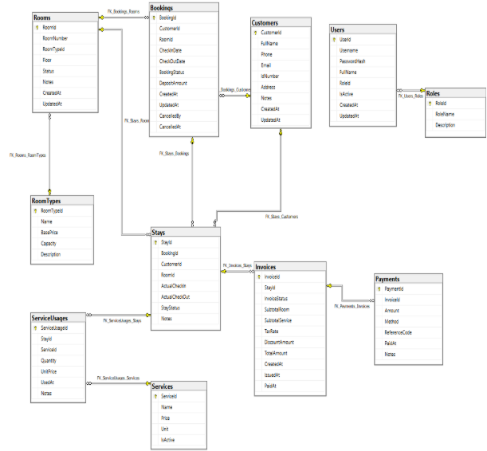

Hình 11: Lược đồ quan hệ
1. # **PHẦN 2. SƠ ĐỒ PHÂN RÃ CHỨC NĂNG**
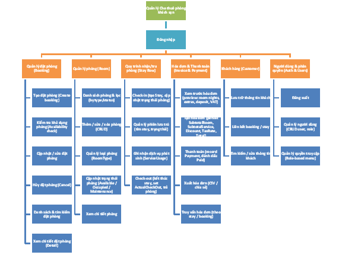

# **PHẦN 3. GIAO DIỆN CỦA CÁC CHỨC NĂNG**
   ## **1. Giao diện Đăng nhập**
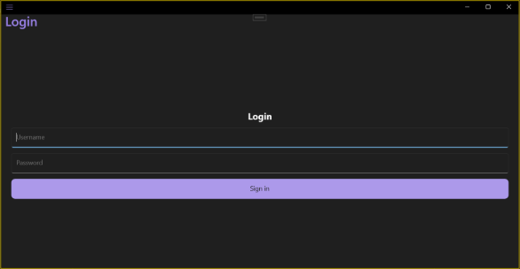

- **Mục đích**: xác thực người dùng, thiết lập phiên đăng nhập.
- **Thành phần**: Entry Username, Entry Password (IsPassword), Button Login.
- **Cách hoạt động**: 
  - Người dùng nhập tên đăng nhập và mật khẩu, nhấn nút **Sign in**.
  - Nếu thông tin đúng → chuyển tới menu chính; nếu sai → hiển thị thông báo lỗi.
  - Có thể hiển thị trạng thái đang xử lý (spinner) trong khi xác thực.

## **2. Giao diện Menu chức năng chính**
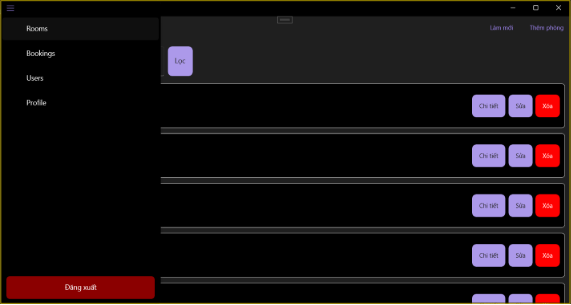

- **Mục đích**: điều hướng chính, hiện/ẩn mục theo role.
- **Thành phần**: Flyout với FlyoutItem (Rooms, Bookings, Users, Profile...), Footer (Đăng xuất).
- **Cách hoạt động**: 
  - Người dùng mở menu (flyout) để chọn khu vực: **Rooms, Bookings, Users(Admin), Profile.**
  - Mục hiển thị thay đổi theo quyền; chọn item mở trang tương ứng.
  - Có nút Đăng xuất trong phần footer; nhấn để thoát và trở về màn đăng nhập.

## **3. Giao diện Quản lý phòng (Rooms)**
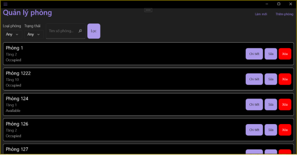

- **Mục đích**: hiển thị danh sách phòng, lọc và thao tác với các phòng.
- **Thành phần**: Filter (RoomType picker, Status picker, Search), CollectionView/ListView (danh sách các phòng), Buttons: **Làm mới, Thêm phòng, Chi tiết, Sửa, Xóa.**
- **Cách hoạt động**: 
  - Người dùng thấy danh sách phòng; có bộ lọc (loại, trạng thái, tìm kiếm).
  - Gõ tìm/ chọn bộ lọc → danh sách cập nhật.
  - Ấn nút **Chi tiết** → mở trang chi tiết phòng hoặc chi tiết booking tương ứng.
  - Có nút **Thêm phòng** để mở form tạo phòng mới.
  - Nút **Làm mới** để load lại danh sách phòng.
  - Nút **Sửa** để mở form sửa thông tin phòng.
  - Nút **Xóa** để xóa phòng khỏi danh sách.

## **4. Giao diện Thêm phòng**
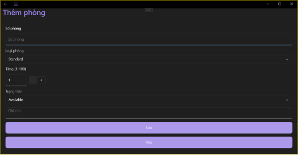

- **Mục đích**: tạo phòng mới (Room).
- **Thành phần**: Entry RoomNumber, Picker RoomType, Stepper/Entry Floor, Status Picker, Notes, nút Lưu/Hủy.
- **Cách hoạt động**: 
  - Người dùng nhập số phòng, chọn loại, tầng, trạng thái, ghi chú.
  - Nhấn Lưu → nếu hợp lệ, quay về danh sách và thấy mục mới; nếu lỗi (ví dụ trùng số) → hiển thị thông báo.

## **5. Giao diện Chi tiết phòng (Trạng thái Available)**
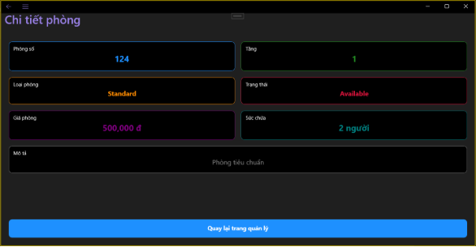

- **Mục đích**: xem thông tin phòng có thể đặt.
- **Thành phần**: **Thông tin phòng** và nút **Quay lại**.
- **Cách hoạt động**: 
  - Người dùng xem thông tin phòng gồm số, tầng, loại, giá, trạng thái, sức chứa.

## **6. Giao diện Chi tiết phòng (Trạng thái Booked)**

- **Mục đích**: hiển thị thông tin phòng đang có booking (chưa nhận phòng).
- **Thành phần**: Thông tin booking active (khách, ngày), nút View Booking (đi tới BookingDetail), nút Edit phòng nếu cần.
- **Cách hoạt động**: 
  - Hiển thị thông tin booking liên quan (**Thông tin đặt phòng, Thông tin phòng**).

## **7. Giao diện Chi tiết phòng (Trạng thái Occupied)**
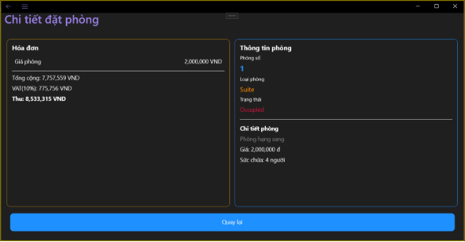

- **Mục đích**: hiển thị phòng đang có khách (đã checkin).
- **Thành phần**: Thông tin Stay (khách, ActualCheckIn), nút CheckOut (đi CheckOutPage), nút View Booking/Stay.
- **Cách hoạt động**: 
  - Hiển thị thông tin khách hiện tại và thời gian nhận phòng.
  - Người dùng có thể mở Check‑out để trả phòng hoặc xem hóa đơn/chi tiết stay.

## **8. Giao diện Chi tiết phòng (Trạng thái Maintenance)**
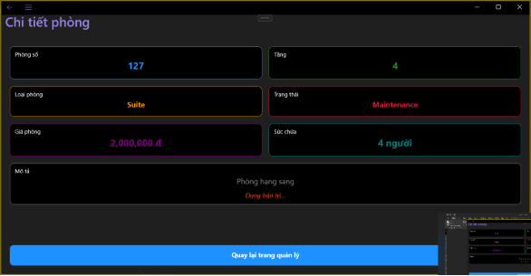

- **Mục đích**: hiển thị phòng đang bảo trì, không cho đặt/nhận.
- **Thành phần**: Thông tin trạng thái Maintenance, notes, nút Edit trạng thái.
- **Cách hoạt động**: 
  - Tương tự Available nhưng hiển thị trạng thái bảo trì và ghi chú.

## **9. Giao diện Chỉnh sửa phòng**
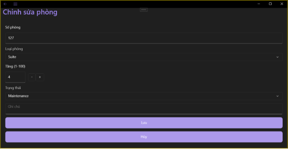

- **Mục đích**: sửa dữ liệu phòng hiện có.
- **Thành phần**: tương tự Thêm phòng, kèm Lưu/Quay lại.
- **Cách hoạt động**: 
  - Người dùng chỉnh các trường phòng rồi nhấn Lưu.
  - Sau lưu thành công quay về chi tiết hoặc danh sách; lỗi hiển thị thông báo.

## **10. Giao diện Quản lý đặt phòng (Bookings)**
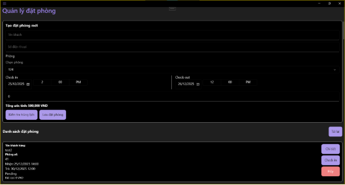

- **Mục đích**: quản lý toàn bộ booking (list, thao tác).
- **Thành phần**: Danh sách booking, filters (status/date), nút New Booking.
- **Cách hoạt động**: 
  - Người dùng có thể tạo mới booking từ form **Tạo đặt phòng mới**
  - Người dùng thấy danh sách booking, có thể lọc theo trạng thái hoặc ngày.
  - Mỗi item có các thao tác nhanh (Xem **Chi tiết, Hủy, Check in**).
  - Chọn item mở BookingDetail.

## **11. Giao diện Danh sách đặt phòng (thuộc Bookings)**
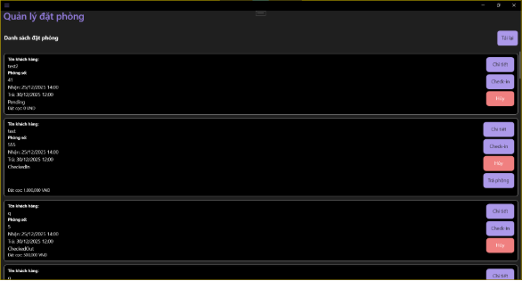

- **Mục đích**: Hiển thị bản ghi booking với trạng thái tóm tắt.
- **Thành phần**: Danh sách item gồm customer, room, dates, status, action buttons.
- **Cách hoạt động**: 
  - Người dùng chọn Bookings trong Menu để thao tác.
  - Người dùng có thể ấn vào **Chi tiết** để chuyển đến trang **Chi tiết đặt phòng** tương ứng với từng trạng thái booking (**Pending, CheckedIn, CheckedOut, Cancelled**).
  - Hành động nhanh như **Hủy** hoặc **Check in** yêu cầu xác nhận và hiển thị kết quả.

## **12. Giao diện Chi tiết đặt phòng (Pending)**
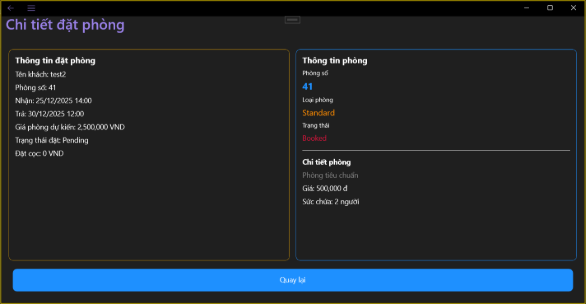

- **Mục đích**: xem booking chưa confirm/nhận phòng.
- **Thành phần**: Thông tin khách, phòng, thời gian, deposit, nút Cancel, nút Check-in (nếu muốn).
- **Cách hoạt động**: 
  - Hiển thị thông tin booking chưa nhận phòng.
  - Người dùng có thể sửa, hủy hoặc thực hiện kiểm tra sẵn sàng (ví dụ: check availability).
  - Hủy/ sửa đều yêu cầu xác nhận/điền dữ liệu.

## **13. Giao diện Chi tiết đặt phòng (CheckedIn)**
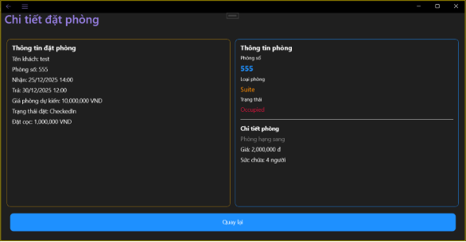

- **Mục đích**: hiển thị booking đã nhận phòng.
- **Thành phần**: Thông tin stay (ActualCheckIn), nút CheckOut (mở CheckOutPage), nút View Invoice nếu có.
- **Cách hoạt động**: 
  - Hiển thị thông tin khách đã nhận phòng (stay).
  - Người dùng có thể thêm dịch vụ (nếu UI hỗ trợ), mở Check out, hoặc xem hóa đơn tạm.
  - Hành động Check in dẫn tới quy trình trả phòng.

## **14. Giao diện Chi tiết đặt phòng (CheckedOut)**
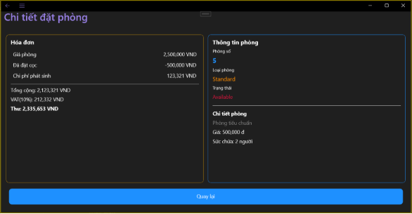

- **Mục đích**: xem booking đã trả phòng; hiển thị hoá đơn.
- **Thành phần**: Thông tin booking/stay, Invoice section (line items từ Invoice table: SubtotalRoom, SubtotalService, Discount, Tax, Total), Payment history.
- **Cách hoạt động**: 
  - Hiển thị thông tin booking và hóa đơn đã tạo.
  - Người dùng xem các dòng hóa đơn, trạng thái thanh toán và lịch sử thanh toán.
  - Có nút Xuất/Chia sẻ hóa đơn.

## **15. Giao diện Chi tiết đặt phòng (Cancelled)**
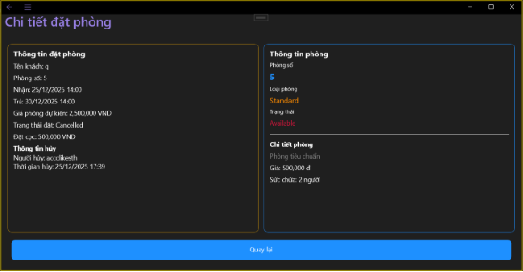

- **Mục đích**: xem booking đã hủy.
- **Thành phần**: Thông tin cancel (CancelledBy, CancelledAt), chi tiết booking cũ, lý do nếu có.
- **Cách hoạt động**: 
  - Hiển thị rằng booking đã bị hủy, ai hủy và khi nào.
  - Người dùng chỉ xem thông tin; các hành động thay đổi bị vô hiệu.

## **16. Giao diện Trả phòng (Check-out)**
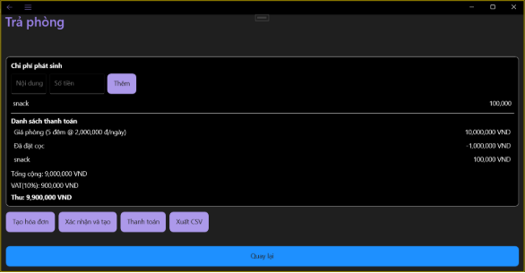

- **Mục đích**: quy trình hoàn tất stay → tạo invoice, thanh toán, xuất.
- **Thành phần**: Preview invoice (PaymentItems list: room, deposit as discount, extras), ExtraCharges editor (mục thêm), Subtotal/Tax/Total labels, nút Tạo hóa đơn (Preview), nút Xác nhận và tạo, Thanh toán, Xuất CSV.
- **Cách hoạt động**: 
  - Người dùng xem bản tóm tắt thanh toán (phòng, phí phát sinh, đã đặt cọc, VAT, tổng).
  - Có khu vực thêm chi phí phát sinh (mô tả + số tiền).
  - Nhấn Tạo hóa đơn để hiển thị bản xem trước; nhấn Xác nhận và tạo để lưu hóa đơn.
  - Sau tạo, có thể Thanh toán (Pay) hoặc Xuất CSV; giao diện hiển thị trạng thái thành công/lỗi.

## **17. Giao diện Profile (gồm change Profile và Password)**
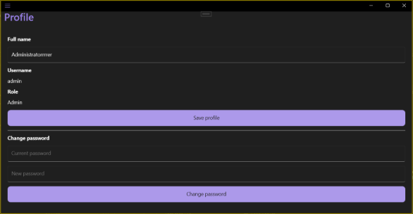

- **Mục đích**: người dùng xem/sửa profile và đổi mật khẩu.
- **Thành phần**: Entry FullName, label Username, label Role, Save profile button; Change password block (CurrentPassword, NewPassword, Change button).
- **Cách hoạt động**: 
  - Người dùng chỉnh Full name và nhấn Save profile để lưu.
  - Ở phần Change password người dùng nhập mật khẩu hiện tại và mật khẩu mới, nhấn Change password để đổi.
  - Giao diện hiển thị thông báo thành công hoặc lỗi (ví dụ mật khẩu sai).

## **18. Giao diện Quản lý User (Admin)**
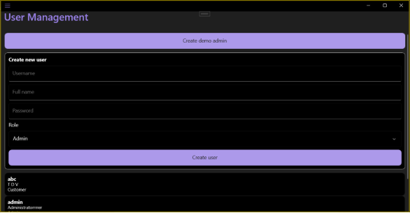

- **Mục đích**: Admin quản lý tài khoản và phân quyền.
- **Thành phần**: Danh sách users, Create/Edit user form (username, fullname, role, password), Delete, search/filter.
- **Cách hoạt động**: 
  - Admin thấy danh sách người dùng, có tìm/lọc.
  - Có nút tạo/sửa/xóa user; form tạo gồm username, fullname, role và mật khẩu.
  - Thao tác yêu cầu xác nhận khi xóa; thay đổi role có thể ảnh hưởng menu ngay sau đó.

